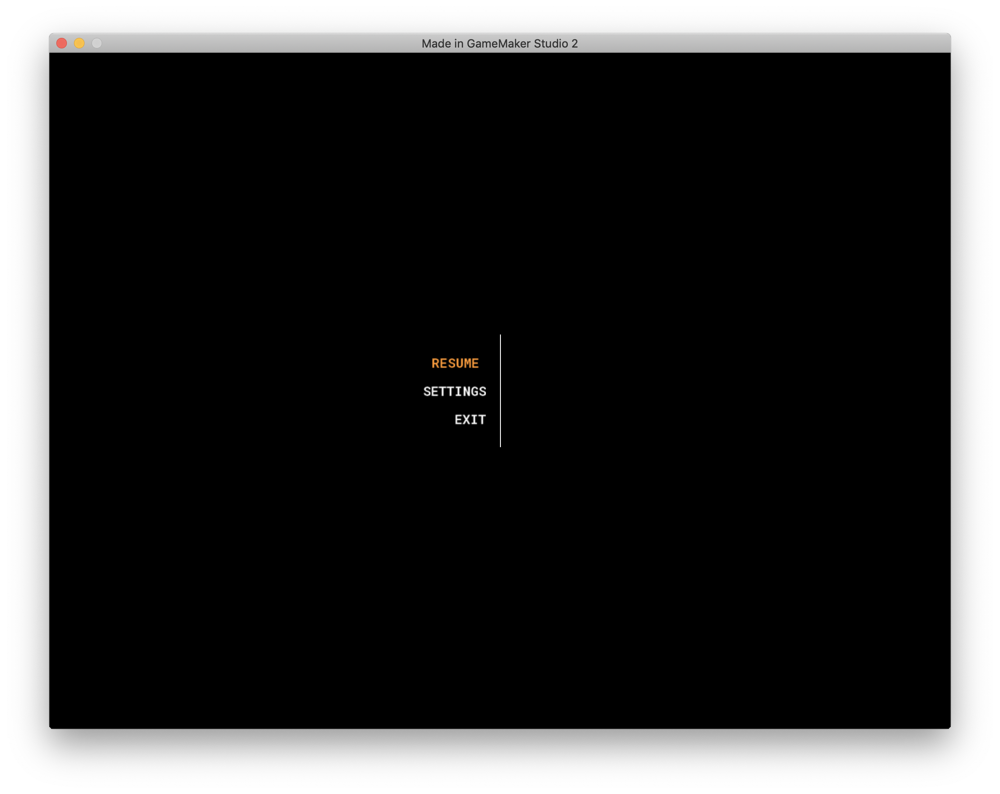
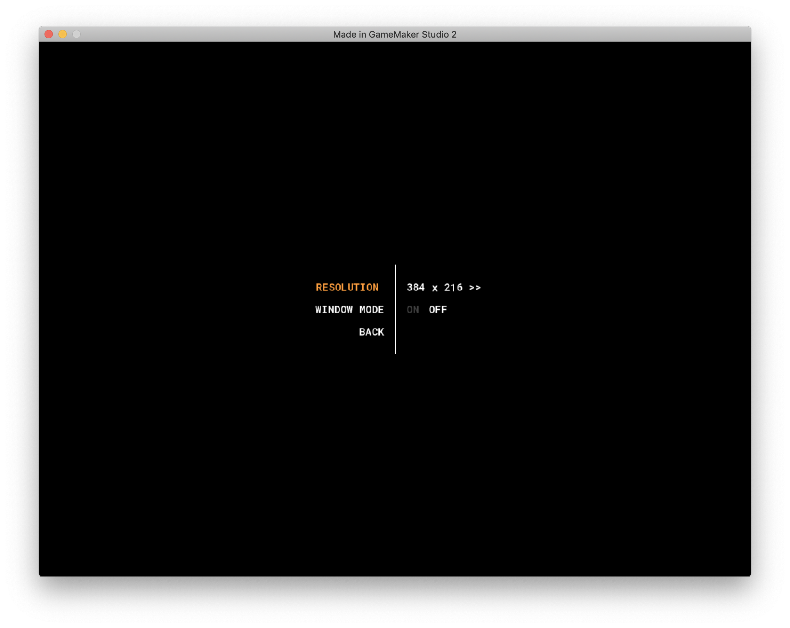
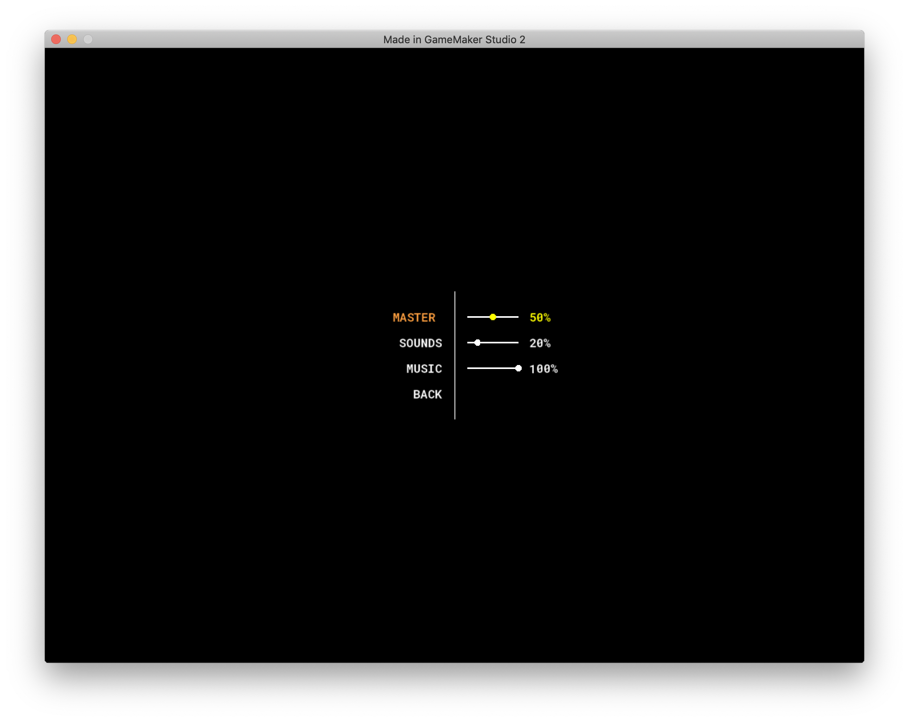
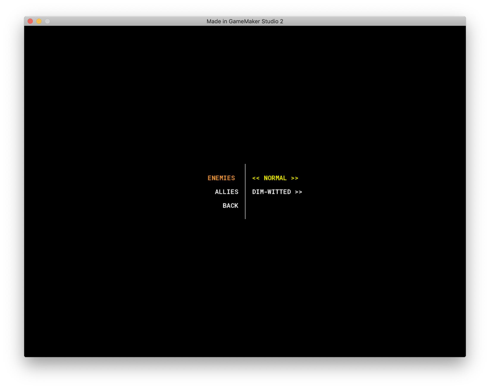

Inspired by [FriendlyCosmonaut's Menu videos](https://www.youtube.com/watch?v=1ITZOrI2qkA&list=PLSFMekK0JFgx2vmcCnttxxhrNVTjUB8R1)

She shows how to create a Settings Menu and how it could be used. There are sliders, toggles, and something she calls a "shift" that allows you to pick from a few different options. She also shows how to connect those settings to how it would be used in a game.

This is a great tutorial.

Note: It looks like she changed some variables halfway thru the video. (ex: ds_grid -> ds_ )

Future possible add-ons/changes:

- ini file to save/read settings
- set the initial room size to one of the possible resolutions
- add sound when navigating/changing option
- add simple game to show how to integrate it (splash screen, start, rules, etc.)
- refactor code so all colors are in one place (black, yellow, white, orange, etc.)
- add a background image
- change font
- try making ESC doing the resume/back

Screenshots:
 

